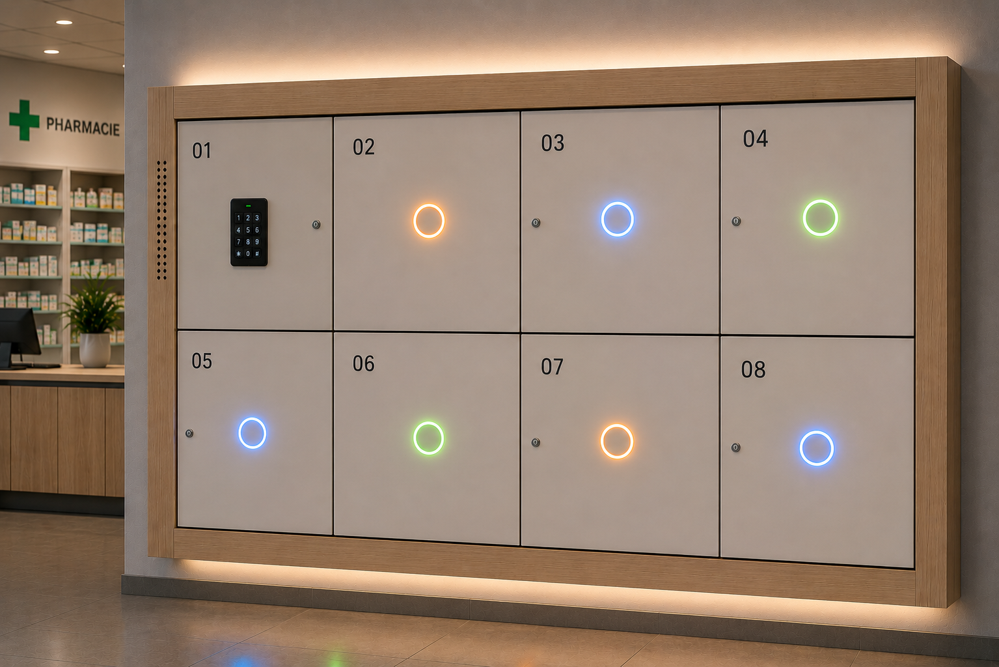

# Smart Locker - Casiers connectés pilotés par Home Assistant

Une personne dépose un colis dans un casier libre, l'affecte à un destinataire via une interface mobile, et ce destinataire reçoit une notification puis récupère son colis en tapant son code personnel devant le meuble. Pas de clé, pas de badge obligatoire, pas d'attente.

---

## Le principe

Le support est une étagère **IKEA Kallax 4x2** (8 casiers), chaque case étant équipée d'une porte, d'une serrure solénoïde et d'un anneau LED pour communiquer l'état au gestionnaire comme au destinataire.

Le cerveau du système est un **Raspberry Pi 4** sous Home Assistant OS. Deux cartes ESP32 lui sont connectées en WiFi : une carte 8 relais qui pilote les serrures et lit l'état des portes, et un digicode Wiegand 26 positionné devant le meuble.

Le système est conçu pour un usage intérieur en environnement de confiance. Pas de sécurité de niveau industriel : l'objectif est la praticité et la traçabilité légère.

---

## Ce que voit l'utilisateur

Un casier passe par quatre états, lisibles d'un coup d'oeil sur l'anneau LED :

| Couleur | État |
|---|---|
| 🟢 Vert fixe | Casier libre |
| 🔵 Bleu fixe | Occupé, destinataire notifié |
| 🟢 Vert clignotant (un seul, autres éteints) | Code correct, ce casier va s'ouvrir |
| 🟠 Orange clignotant | Porte ouverte depuis trop longtemps |
| 🔴 Rouge clignotant (tous, 3s) | Code incorrect |
| 🔴 Rouge fixe | Casier hors service |

---

## Documentation technique

Tout ce qu'il faut pour construire et configurer le système :

- [Serrure solénoïde](docs/hardware/serrure.md) - pilotage relais et retour via reed switch
- [Alimentation](docs/hardware/alimentation.md) - architecture 230V / 12V 20A
- [Contrôleur LED WLED Gledopto](docs/hardware/wled-gledopto.md) - 4 voies pour 8 casiers
- [Fraisage logements LED](docs/hardware/fraisage.md) - gabarit 3D et défonceuse
- [ESPHome - Carte relais](docs/esphome/carte-relais.md) - config complète LC-Relay-ESP32-8R-D5
- [ESPHome - Digicode Wiegand 26](docs/esphome/digicode-wiegand.md) - saisie code PIN
- [Home Assistant - Intégrations](docs/home-assistant/integrations.md) - entités, helpers, automatisations
- [Backend Python](docs/backend/README.md) - logique métier (à venir)
