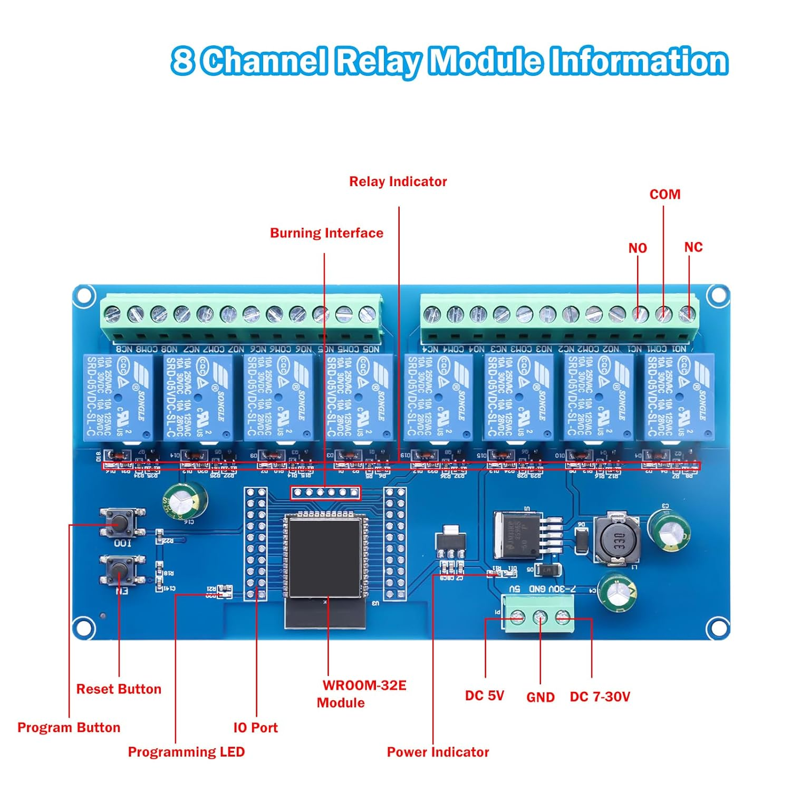
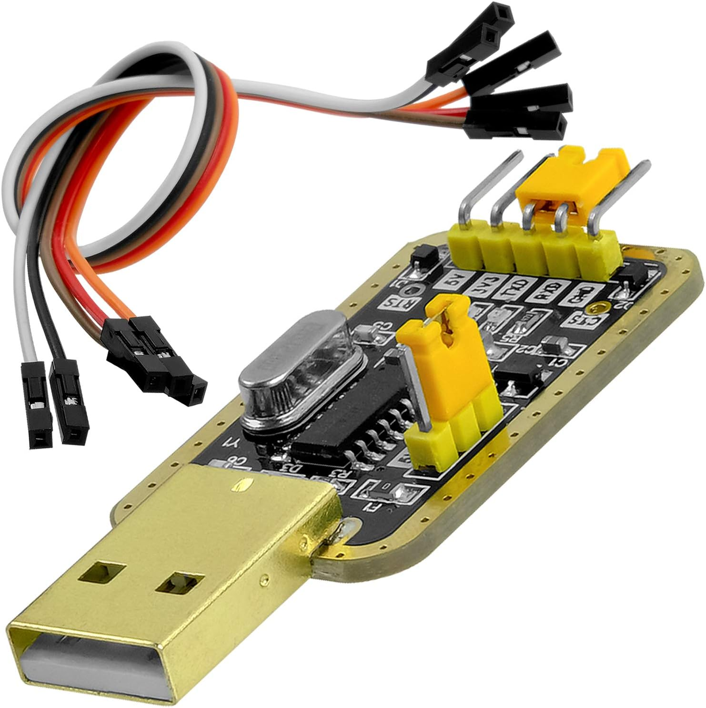

# ESPHome - Carte relais LC-Relay-ESP32-8R-D5



La **LC-Relay-ESP32-8R-D5** est une carte tout-en-un combinant :
- Un module **ESP32** (WiFi + Bluetooth)
- **8 relais** 10A/250VAC (utilisés ici en 12V DC)
- Alimentation directe en **12V** (régulateur embarqué 3.3V/5V pour l'ESP32)
- Connecteurs screw terminal pour chaque relais (COM/NO/NC)

## Brochage utilisé

| Fonction | GPIO ESP32 | Composant |
|---|---|---|
| Relais casier 1 | GPIO32 | Serrure solénoïde 1 |
| Relais casier 2 | GPIO33 | Serrure solénoïde 2 |
| Relais casier 3 | GPIO25 | Serrure solénoïde 3 |
| Relais casier 4 | GPIO26 | Serrure solénoïde 4 |
| Relais casier 5 | GPIO27 | Serrure solénoïde 5 |
| Relais casier 6 | GPIO14 | Serrure solénoïde 6 |
| Relais casier 7 | GPIO12 | Serrure solénoïde 7 |
| Relais casier 8 | GPIO13 | Serrure solénoïde 8 |
| Reed switch 1 | GPIO34 | État porte casier 1 |
| Reed switch 2 | GPIO35 | État porte casier 2 |
| Reed switch 3 | GPIO36 | État porte casier 3 |
| Reed switch 4 | GPIO39 | État porte casier 4 |
| Reed switch 5 | GPIO4 | État porte casier 5 |
| Reed switch 6 | GPIO16 | État porte casier 6 |
| Reed switch 7 | GPIO17 | État porte casier 7 |
| Reed switch 8 | GPIO5 | État porte casier 8 |

> **A vérifier** : les GPIO proposés pour les reed switches (GPIO4, 5, 16, 17, 34, 35, 36, 39) sont
> théoriquement libres sur un ESP32 standard, mais certains peuvent être utilisés par la carte pour
> d'autres fonctions selon la version du PCB. Vérifier le pinout exact sur le
> [forum HACF](https://forum.hacf.fr/t/carte-8-relais-avec-esp32-branchement-usb-uart/48181)
> avant de câbler.
>
> GPIO 34, 35, 36 et 39 sont en **entrée uniquement** sur l'ESP32 (pas de pull-up interne).
> Ajouter une résistance pull-up externe 10kΩ vers le 3,3V pour chacun de ces quatre GPIO.

## Configuration ESPHome

```yaml
# smartlocker-relais.yaml
substitutions:
  device_name: smartlocker-relais
  friendly_name: "Smart Locker - Relais"

esphome:
  name: ${device_name}
  friendly_name: ${friendly_name}

esp32:
  board: esp32dev
  framework:
    type: arduino

logger:
api:
  encryption:
    key: !secret api_encryption_key
ota:
  password: !secret ota_password
wifi:
  ssid: !secret wifi_ssid
  password: !secret wifi_password
  ap:
    ssid: "${device_name} Fallback"
    password: !secret fallback_password

# Relais

switch:
  - platform: gpio
    name: "Relais casier 1"
    id: relay_1
    pin: GPIO32
    restore_mode: ALWAYS_OFF

  - platform: gpio
    name: "Relais casier 2"
    id: relay_2
    pin: GPIO33
    restore_mode: ALWAYS_OFF

  - platform: gpio
    name: "Relais casier 3"
    id: relay_3
    pin: GPIO25
    restore_mode: ALWAYS_OFF

  - platform: gpio
    name: "Relais casier 4"
    id: relay_4
    pin: GPIO26
    restore_mode: ALWAYS_OFF

  - platform: gpio
    name: "Relais casier 5"
    id: relay_5
    pin: GPIO27
    restore_mode: ALWAYS_OFF

  - platform: gpio
    name: "Relais casier 6"
    id: relay_6
    pin: GPIO14
    restore_mode: ALWAYS_OFF

  - platform: gpio
    name: "Relais casier 7"
    id: relay_7
    pin: GPIO12
    restore_mode: ALWAYS_OFF

  - platform: gpio
    name: "Relais casier 8"
    id: relay_8
    pin: GPIO13
    restore_mode: ALWAYS_OFF

# Boutons virtuels - impulsion 400 ms
# Utilises par Home Assistant pour declencher l'ouverture d'un casier

button:
  - platform: template
    name: "Ouvrir casier 1"
    on_press:
      - switch.turn_on: relay_1
      - delay: 400ms
      - switch.turn_off: relay_1

  - platform: template
    name: "Ouvrir casier 2"
    on_press:
      - switch.turn_on: relay_2
      - delay: 400ms
      - switch.turn_off: relay_2

  - platform: template
    name: "Ouvrir casier 3"
    on_press:
      - switch.turn_on: relay_3
      - delay: 400ms
      - switch.turn_off: relay_3

  - platform: template
    name: "Ouvrir casier 4"
    on_press:
      - switch.turn_on: relay_4
      - delay: 400ms
      - switch.turn_off: relay_4

  - platform: template
    name: "Ouvrir casier 5"
    on_press:
      - switch.turn_on: relay_5
      - delay: 400ms
      - switch.turn_off: relay_5

  - platform: template
    name: "Ouvrir casier 6"
    on_press:
      - switch.turn_on: relay_6
      - delay: 400ms
      - switch.turn_off: relay_6

  - platform: template
    name: "Ouvrir casier 7"
    on_press:
      - switch.turn_on: relay_7
      - delay: 400ms
      - switch.turn_off: relay_7

  - platform: template
    name: "Ouvrir casier 8"
    on_press:
      - switch.turn_on: relay_8
      - delay: 400ms
      - switch.turn_off: relay_8

# Reed switches

binary_sensor:
  - platform: gpio
    name: "Porte casier 1"
    id: door_1
    pin:
      number: GPIO34
      mode: INPUT        # Pull-up externe 10kOhm requis
    device_class: door
    filters:
      - delayed_on: 50ms
      - delayed_off: 50ms

  - platform: gpio
    name: "Porte casier 2"
    id: door_2
    pin:
      number: GPIO35
      mode: INPUT        # Pull-up externe 10kOhm requis
    device_class: door
    filters:
      - delayed_on: 50ms
      - delayed_off: 50ms

  - platform: gpio
    name: "Porte casier 3"
    id: door_3
    pin:
      number: GPIO36
      mode: INPUT        # Pull-up externe 10kOhm requis
    device_class: door
    filters:
      - delayed_on: 50ms
      - delayed_off: 50ms

  - platform: gpio
    name: "Porte casier 4"
    id: door_4
    pin:
      number: GPIO39
      mode: INPUT        # Pull-up externe 10kOhm requis
    device_class: door
    filters:
      - delayed_on: 50ms
      - delayed_off: 50ms

  - platform: gpio
    name: "Porte casier 5"
    id: door_5
    pin:
      number: GPIO4
      mode: INPUT_PULLUP
    device_class: door
    filters:
      - delayed_on: 50ms
      - delayed_off: 50ms

  - platform: gpio
    name: "Porte casier 6"
    id: door_6
    pin:
      number: GPIO16
      mode: INPUT_PULLUP
    device_class: door
    filters:
      - delayed_on: 50ms
      - delayed_off: 50ms

  - platform: gpio
    name: "Porte casier 7"
    id: door_7
    pin:
      number: GPIO17
      mode: INPUT_PULLUP
    device_class: door
    filters:
      - delayed_on: 50ms
      - delayed_off: 50ms

  - platform: gpio
    name: "Porte casier 8"
    id: door_8
    pin:
      number: GPIO5
      mode: INPUT_PULLUP
    device_class: door
    filters:
      - delayed_on: 50ms
      - delayed_off: 50ms
```

## Points d'attention

- **restore_mode: ALWAYS_OFF** : garantit que les relais sont ouverts au redémarrage.
- L'ESP32 de cette carte peut avoir les niveaux de GPIO relais inversés (actif LOW) selon la version du PCB. Si les relais fonctionnent à l'envers, ajouter `inverted: true` sur les pins concernées.

## Flashage initial



La carte ne dispose pas d'un port USB natif. Le premier flash passe par un adaptateur **USB-UART TTL** externe.

Pinout de la carte : [forum HACF](https://forum.hacf.fr/t/carte-8-relais-avec-esp32-branchement-usb-uart/48181)

### Câblage USB-UART vers carte

| USB-UART | Carte LC-Relay |
|---|---|
| TX | RX de la carte |
| RX | TX de la carte |
| GND | GND |
| 5V | VCC de la carte |

Le 5V fourni par l'adaptateur USB-UART suffit à alimenter l'ESP32 pendant le flash.

### Passage en mode flash

Mettre un cavalier entre **GND et GPIO0** avant de brancher l'USB-UART, pour forcer l'ESP32 en mode bootloader. Retirer le cavalier après le flash.

### Commande

```bash
esphome compile smartlocker-relais.yaml

esptool --chip esp32 \
        --port /dev/ttyUSB0 \
        --baud 460800 \
        write_flash -z 0x0 \
        ~/Telechargenents/smartlocker-relais.factory.bin
```

Identifier le bon port avec `ls /dev/tty*` avant et après branchement de l'adaptateur.

Les mises à jour suivantes se font en OTA depuis l'interface ESPHome de Home Assistant.
