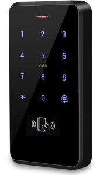

# ESPHome - Digicode Wiegand



Référence : [composant wiegand ESPHome](https://esphome.io/components/wiegand/)

Le digicode se connecte à un ESP32 dédié via deux fils data (D0 et D1). L'ESP32 décode les touches
et les assemble en code PIN via le composant `key_collector`, puis transmet le code complet à
Home Assistant.

---

## Câblage

| Digicode | ESP32 |
|---|---|
| VCC | 12V |
| GND | GND |
| D0 | GPIO4 |
| D1 | GPIO5 |

> Les lignes D0/D1 fonctionnent en logique 5V. L'ESP32 tolère généralement ces niveaux en entrée,
> mais en cas de problème ajouter un diviseur de tension ou un level-shifter.

---

## Configuration ESPHome

Le composant `wiegand` capture chaque touche via `on_key`. Le composant `key_collector` les
assemble en séquence et déclenche l'envoi à Home Assistant quand l'utilisateur appuie sur `#`.
La touche `*` efface la saisie en cours.

```yaml
# smartlocker-digicode.yaml
substitutions:
  device_name: smartlocker-digicode
  friendly_name: "Smart Locker - Digicode"

esphome:
  name: ${device_name}
  friendly_name: ${friendly_name}

esp32:
  board: esp32dev
  framework:
    type: arduino

logger:
  level: INFO
  # Ne pas logger les codes PIN en production

api:
  encryption:
    key: !secret api_encryption_key
ota:
  password: !secret ota_password
wifi:
  ssid: !secret wifi_ssid
  password: !secret wifi_password

# Wiegand - capture touche par touche

wiegand:
  - id: keypad
    d0: GPIO4
    d1: GPIO5
    on_key:
      - key_collector.collect:
          id: pin_collector
          key: !lambda |
            if (x >= 0 && x <= 9) return ('0' + x);
            if (x == 10) return '*';
            if (x == 11) return '#';
            return 0;

# key_collector - assemble les touches en code PIN

key_collector:
  - id: pin_collector
    min_length: 4
    max_length: 8
    end_keys: "#"
    end_key_required: true
    back_keys: "*"
    timeout: 10s
    on_result:
      - text_sensor.template.publish:
          id: pin_code
          state: !lambda 'return x;'
      - homeassistant.event:
          event: esphome.keypad_code_entered
          data:
            code: !lambda 'return x;'
    on_timeout:
      - text_sensor.template.publish:
          id: pin_code
          state: ""

# Expose le dernier code saisi comme entite Home Assistant

text_sensor:
  - platform: template
    name: "Code digicode"
    id: pin_code
    icon: "mdi:dialpad"
```

### Touches speciales

| Valeur Wiegand | Touche physique | Role dans key_collector |
|---|---|---|
| 0-9 | Chiffres | Saisie du code |
| 10 | `*` | Efface la saisie en cours |
| 11 | `#` | Valide et envoie le code |

---

## Cote Home Assistant

Quand l'utilisateur valide avec `#`, l'evenement `esphome.keypad_code_entered` est fire avec le
code en data. Une automatisation HA se charge de verifier le code et d'ouvrir le bon casier.

```yaml
alias: "Digicode - verification code PIN"
trigger:
  - platform: event
    event_type: esphome.keypad_code_entered
action:
  - variables:
      code_saisi: "{{ trigger.event.data.code }}"
  # Verification et ouverture du casier - voir backend Python
```

> La logique de verification est plus propre dans le backend Python.
> Voir [backend/README.md](../backend/README.md).

---

## Notes

- Certains digicodes ont besoin d'une remise a zero usine pour passer en mode sortie Wiegand 26/34.
  Consulter la notice du modele si les touches ne sont pas recues par l'ESP32.
- Le `key_collector` attend `#` pour valider. Si le digicode envoie le PIN complet d'un coup
  via `on_tag` (comportement de certains modeles), utiliser directement `on_tag` et supprimer
  le `key_collector`.
- `text_sensor` publie le code en clair dans Home Assistant. Prevoir de l'effacer apres traitement.
