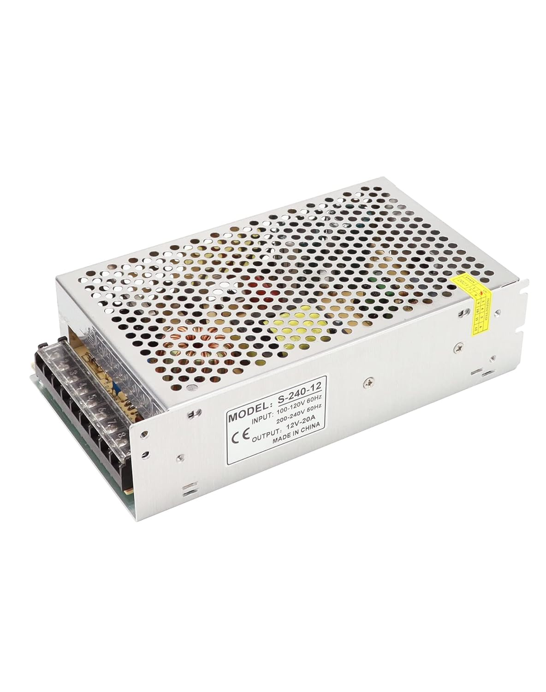

# Alimentation

## Architecture

| Source | Consommateur |
|---|---|
| Transformateur 12V / 20A | Carte ESP32, serrures x8, anneaux LED x8 |
| Alimentation USB-C officielle Raspberry Pi | Raspberry Pi 4 |

## Pourquoi 20A sur le 12V ?

| Consommateur | Courant estimé |
|---|---|
| Solénoïdes x8 (inrush simultané max) | 8 x 1 A = 8 A |
| Carte LC-Relay-ESP32-8R-D5 | ~0,5 A |
| Anneaux NeoPixel WS2812B x8 (plein blanc) | 8 x 0,72 A = ~5,8 A |
| **Total crête théorique** | **~14 A** |

En pratique les solénoïdes fonctionnent en impulsionnel (400 ms) et ne sont jamais tous actifs simultanément. Les LED ne sont jamais toutes à plein blanc. Un transformateur 12V / 20A offre une marge confortable.

## Distribution 12V

Le transformateur dispose directement de plusieurs paires de bornes V+/V- en sortie. Chaque consommateur (serrures, anneaux LED, carte ESP32) est raccordé directement sur ces bornes avec du câble 2x0,5 mm².

## Bouton d'urgence

Le bouton connecte directement le +12V sur toutes les serrures, sans passer par les relais ni l'ESP32. Il fonctionne même en cas de panne logicielle. À placer dans un endroit à accès restreint.
