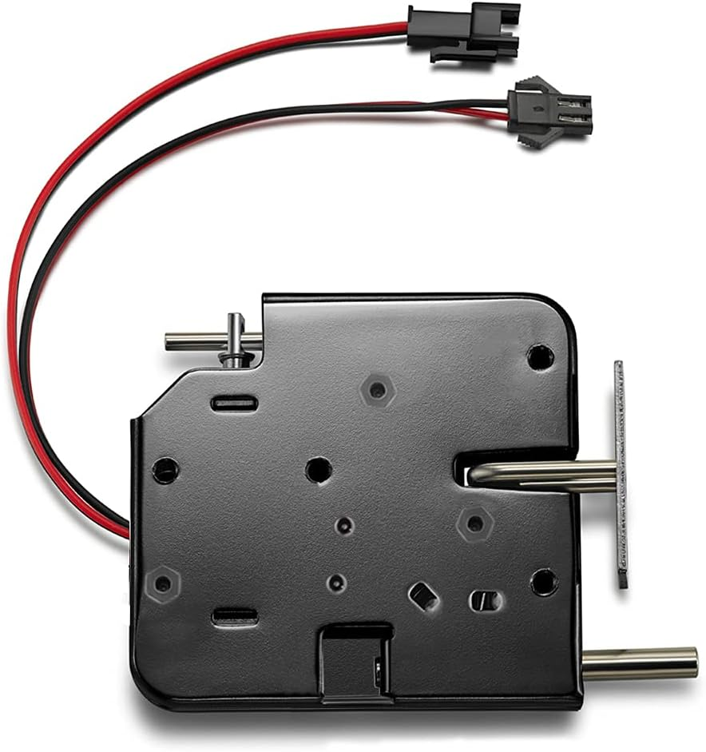

# Serrure solénoïde

Référence : **Amazon B07KWMH16C** - solénoïde de porte 12V DC, type fail-secure.

> **Attention** : ne jamais maintenir la serrure alimentée en continu plus de 5 secondes. Le solénoïde chauffe très vite et grille. Une impulsion courte (400 ms) suffit, le mécanisme mécanique maintient l'ouverture jusqu'à ce que la porte soit refermée.

---

## Principe de fonctionnement

La serrure est de type **fail-secure** : sans courant, le verrou est sorti et la porte est verrouillée. C'est le comportement souhaité en cas de coupure de courant ou de panne du système.

| Alimentation | Verrou | Porte |
|---|---|---|
| 0V (repos) | Sorti | Verrouillée |
| 12V (impulsion) | Rentré | Déverrouillée |

La serrure est également équipée d'un **axe métallique sur ressort** qui pousse physiquement la porte dès que le verrou rentre. Pas besoin de tirer : la porte s'entrouvre d'elle-même à l'ouverture.

---

## Pilotage via relais

Chaque serrure est commandée par un relais de la carte LC-Relay-ESP32-8R-D5.

Le relais se comporte comme un interrupteur commandé par l'ESP32. Au repos, ses contacts sont ouverts et la serrure ne reçoit pas de courant. Quand l'ESP32 active le relais, les contacts se ferment et le +12V alimente le solénoïde pendant la durée de l'impulsion.

Le relais dispose de trois bornes :

- **COM** (common) - reliée au +12V de l'alimentation
- **NO** (normally open) - reliée au + du solénoïde, circuit ouvert au repos
- **NC** (normally closed) - non utilisée ici

Quand le relais s'active, COM et NO se connectent : le +12V passe dans le solénoïde, le verrou rentre, la porte s'ouvre.

---

## Retour d'état via reed switch

Un **reed switch MC-38** est fixé sur le châssis de chaque casier, en face d'un petit aimant solidaire de la porte.

Le reed switch est simplement deux fils. L'un est relié à un GPIO de l'ESP32 (pull-up activé), l'autre au GND. Quand la porte est fermée, l'aimant ferme le contact interne du reed switch et le GPIO lit LOW. Quand la porte s'ouvre, l'aimant s'éloigne, le contact s'ouvre et le GPIO lit HIGH.

| État de la porte | Contact reed switch | Valeur lue par l'ESP32 |
|---|---|---|
| Fermée | Fermé | LOW |
| Ouverte | Ouvert | HIGH |

ESPHome expose cet état comme un `binary_sensor` de classe `door`.

---

## Câblage (par casier)

### Serrure solénoïde

| Fil | Départ | Arrivée | Section |
|---|---|---|---|
| Alim + | +12V bornier | Borne COM du relais | 0,5 mm² |
| Alim + serrure | Borne NO du relais | Solénoïde (+) | 0,5 mm² |
| Alim - serrure | Solénoïde (-) | GND bornier | 0,5 mm² |

### Reed switch

| Fil | Départ | Arrivée | Section |
|---|---|---|---|
| Signal | GPIO_n de l'ESP32 (pull-up) | Borne A du reed switch | 0,22 mm² |
| Retour | Borne B du reed switch | GND | 0,22 mm² |

---

## Notes de montage

- Fixer la partie magnétique sur le battant de la porte, la partie contact sur le châssis fixe.
- Aligner soigneusement : le déclenchement doit être fiable jusqu'à 2 mm de jeu.
- Les GPIO 34, 35, 36 et 39 de l'ESP32 n'ont pas de pull-up interne - ajouter une résistance 10 kOhm externe vers le 3,3V pour ces entrées.
