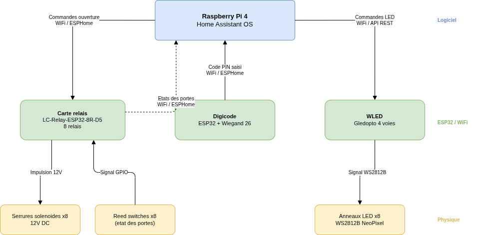

# Documentation Smart Locker

## Architecture

Le schéma source est disponible dans [architecture.drawio](architecture.drawio) (ouvrable sur [diagrams.net](https://app.diagrams.net)).

---

## Table des matières

### Matériel
- [Serrure solénoïde](hardware/serrure.md) - Pilotage via relais, retour d'état via reed switch
- [Alimentation](hardware/alimentation.md) - Architecture 230V → 12V/20A
- [Contrôleur LED WLED Gledopto](hardware/wled-gledopto.md) - Anneau LED par casier, 4 voies pour 8 casiers
- [Fraisage logements LED](hardware/fraisage.md) - Défonceuse, gabarit 3D, bague de copiage

### ESPHome
- [Carte relais LC-Relay-ESP32-8R-D5](esphome/carte-relais.md) - 8 relais, reed switches, NeoPixel
- [Digicode Wiegand 26](esphome/digicode-wiegand.md) - Saisie de code PIN, protocole Wiegand 26

### Home Assistant
- [Intégrations](home-assistant/integrations.md) - ESPHome, WLED, MQTT, helpers, entités

### Backend
- [Backend Python](backend/README.md) - Logique métier, gestion des casiers, API (à venir)

### Projet
- [Budget](budget.md) - Liste des composants et coûts

---

> Ce projet tourne sur un Raspberry Pi 4 sous Home Assistant OS.
> Support physique : IKEA Kallax 4×2 (8 casiers).
> Voir le [README principal](../README.md) pour la vue d'ensemble.
